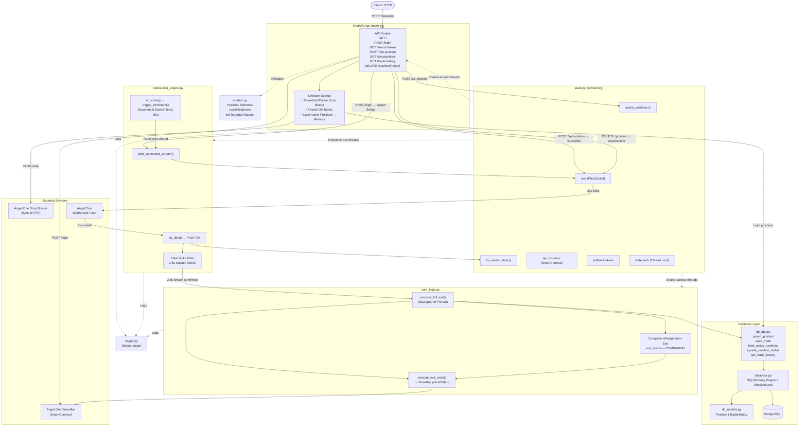

# TradingAPI — Architecture Document

## Table of Contents

1. [System Overview](#1-system-overview)
2. [High-Level Architecture](#2-high-level-architecture)
3. [Project Structure](#3-project-structure)
4. [Module Breakdown](#4-module-breakdown)
   - [main.py — Application Entry Point](#41-mainpy--application-entry-point)
   - [state.py — Shared In-Memory State](#42-statepy--shared-in-memory-state)
   - [websocket_engine.py — Live Market Feed](#43-websocket_enginepy--live-market-feed)
   - [core_logic.py — Exit Order Execution](#44-core_logicpy--exit-order-execution)
   - [models.py — Pydantic Schemas](#45-modelspy--pydantic-schemas)
   - [database.py — DB Connection](#46-databasepy--db-connection)
   - [db_models.py — ORM Models](#47-db_modelspy--orm-models)
   - [db_ops.py — Database Operations](#48-db_opspy--database-operations)
   - [logger.py — Logging](#49-loggerpy--logging)
5. [Data Flow](#5-data-flow)
   - [Login & WebSocket Startup](#51-login--websocket-startup)
   - [Set Position & Subscribe](#52-set-position--subscribe)
   - [Live Price Tick & Fake Spike Filter](#53-live-price-tick--fake-spike-filter)
   - [Exit Order Execution](#54-exit-order-execution)
   - [WebSocket Reconnect](#55-websocket-reconnect)
6. [Concurrency Model](#6-concurrency-model)
7. [Database Schema](#7-database-schema)
8. [API Reference](#8-api-reference)
9. [Environment & Configuration](#9-environment--configuration)
10. [Testing Strategy](#10-testing-strategy)
11. [Tech Stack](#11-tech-stack)

---

## 1. System Overview

TradingAPI is a FastAPI-based automated trading backend that integrates with the **Angel One SmartApi** broker platform. It monitors live market prices via WebSocket, applies a **Fake Spike Filter** before executing exit orders, and persists all position and trade data in **PostgreSQL** — surviving server restarts.

**Core responsibilities:**
- Authenticate with Angel One using TOTP-based login
- Stream live market prices via WebSocket
- Monitor active positions against Target / Stop-Loss levels
- Filter fake price spikes (2.5-second sustain check) before firing orders
- Auto-exit companion/hedge positions when one leg exits
- Persist all state to PostgreSQL; restore on restart

---

## 2. High-Level Architecture



---

## 3. Project Structure

```
TradingAPI/
├── main.py                  # FastAPI app, lifespan, all HTTP routes
├── state.py                 # Shared in-memory state (singleton globals)
├── websocket_engine.py      # WebSocket stream, spike filter, reconnect logic
├── core_logic.py            # Exit order execution, companion auto-exit
├── models.py                # Pydantic request/response schemas
├── database.py              # SQLAlchemy engine + session factory
├── db_models.py             # ORM table definitions (Position, TradeHistory)
├── db_ops.py                # All DB read/write operations
├── logger.py                # Centralized stdout logger
├── alembic/                 # DB migration scripts
│   ├── env.py
│   └── versions/
├── test_main.py             # API + core logic tests (pytest)
├── test_db_ops.py           # DB layer tests (SQLite in-memory)
├── requirements.txt
├── .env.example
└── README.md
```

---

## 4. Module Breakdown

### 4.1 `main.py` — Application Entry Point

The root of the application. Responsible for:

- **Lifespan startup:** Downloads and caches the Angel One Scrip Master JSON (once per day). Creates DB tables via SQLAlchemy. Loads all `ACTIVE` positions from PostgreSQL back into `state.active_positions` so monitoring resumes after a restart.
- **SmartConnect initialization:** Creates the global `SmartConnect` instance and stores it in `state.api_instance`.
- **HTTP route definitions:** All 7 API endpoints are defined here.

**Key design decision:** The `SmartConnect` instance is created at module load time (not inside a route), so it is available globally before any request is made.

---

### 4.2 `state.py` — Shared In-Memory State

Acts as the single source of truth for all runtime state shared across threads.

| Variable | Type | Purpose |
|---|---|---|
| `active_positions` | `dict` | Token → position config + monitoring state |
| `liv_market_data` | `dict` | Token → latest live price (paise → rupees) |
| `api_instance` | `SmartConnect` | Angel One API client |
| `sws` | `SmartWebSocketV2` | Active WebSocket connection |
| `current_jwt_token` | `str` | Stored for WebSocket reconnect |
| `current_feed_token` | `str` | Stored for WebSocket reconnect |
| `reconnect_attempts` | `int` | Tracks backoff count |
| `is_broker_connected` | `bool` | Login status flag |
| `state_lock` | `threading.Lock` | Mutex for `active_positions` writes |

**Why a module-level singleton?** FastAPI runs in a single process. Using a plain Python module as a singleton avoids the overhead of dependency injection while keeping state accessible from all threads (WebSocket, background exit threads, HTTP handlers).

---

### 4.3 `websocket_engine.py` — Live Market Feed

Manages the full lifecycle of the Angel One WebSocket connection.

**`start_websocket_stream(API_KEY, CLIENT_ID, jwt_token, feed_token)`**
- Initializes `SmartWebSocketV2` and stores it in `state.sws`
- Registers four callbacks: `on_open`, `on_data`, `on_error`, `on_close`
- Calls `sws.connect()` — this is a **blocking call**, which is why it runs in a daemon thread

**`on_open`**
- Resets `reconnect_attempts` to 0
- Re-subscribes all `ACTIVE` positions (handles reconnect scenario)

**`on_data` — Fake Spike Filter Logic**

```
Price tick received
        │
        ▼
Is token in active_positions AND status == ACTIVE?
        │
       YES
        │
        ▼
Price >= target OR price <= sl?
   ┌────┴────┐
  YES        NO
   │          │
   ▼          ▼
breach_time   breach_time set?
set (first      │
 hit)          YES → reset breach_time (fake spike ignored)
   │
   ▼
time_elapsed >= 2.5s?
   │
  YES
   │
   ▼
Mark status = EXITED
Spawn background thread → process_full_exit()
```

**`trigger_reconnect`** — Exponential backoff: `wait = min(attempts × 5, 30)` seconds. Spawns a new `start_websocket_stream` thread using stored tokens.

**`get_exchange_type(exchange)`** — Maps exchange string to Angel One numeric ID (NSE=1, NFO=2, BSE=3, MCX=5, NCDEX=7, CDS=13).

---

### 4.4 `core_logic.py` — Exit Order Execution

Runs in a **background daemon thread** (fire-and-forget) to avoid blocking the WebSocket `on_data` callback.

**`execute_exit_order(smartApi_instance, token, order_info)`**
- Builds Angel One `placeOrder` params (MARKET order, DAY duration)
- Returns `order_id` on success, `None` on failure

**`process_full_exit(token, order)`**
1. Calls `execute_exit_order` for the primary token
2. Saves trade to DB via `save_trade`
3. Updates position status to `EXITED` in DB
4. If `linked_token` exists and its status is `ACTIVE` → acquires `state_lock`, marks companion as `EXITED`, then calls `execute_exit_order` for the companion
5. Saves companion trade with `exit_reason = "COMPANION"`

**Why a separate thread?** `on_data` is called on the WebSocket thread. Placing a broker order (network I/O) inside it would block incoming ticks. Decoupling via `threading.Thread` keeps the feed responsive.

---

### 4.5 `models.py` — Pydantic Schemas

| Schema | Used In | Purpose |
|---|---|---|
| `TokenData` | `LoginResponse` | Nested JWT + feed token |
| `LoginResponse` | `POST /login` | Response shape for login |
| `SetTargetSLRequest` | `POST /set-position` | Request validation for position setup |

`SetTargetSLRequest` fields: `token`, `target`, `sl`, `tradingsymbol`, `exchange`, `quantity`, `exit_type` (default `SELL`), `product_type` (default `INTRADAY`), `linked_token` (optional).

---

### 4.6 `database.py` — DB Connection

- Creates a SQLAlchemy `engine` from `DATABASE_URL` env var with `pool_pre_ping=True` (auto-reconnects stale connections)
- Exposes `SessionLocal` (session factory) and `Base` (declarative base for ORM models)

---

### 4.7 `db_models.py` — ORM Models

**`Position`** table — `positions`

| Column | Type | Notes |
|---|---|---|
| `token` | String (PK) | Angel One instrument token |
| `tradingsymbol` | String | e.g. `CRUDEOIL24MAY6500CE` |
| `exchange` | String | NSE / NFO / MCX etc. |
| `target` | Float | Target price |
| `sl` | Float | Stop-loss price |
| `quantity` | Integer | Lot size |
| `exit_type` | String | `SELL` / `BUY` |
| `product_type` | String | `INTRADAY` / `CARRYFORWARD` |
| `linked_token` | String (nullable) | Companion/hedge token |
| `status` | String | `ACTIVE` / `EXITED` |
| `created_at` | DateTime | UTC timestamp |

**`TradeHistory`** table — `trade_history`

| Column | Type | Notes |
|---|---|---|
| `id` | Integer (PK, auto) | Auto-increment |
| `token` | String | Instrument token |
| `tradingsymbol` | String | Symbol name |
| `exit_reason` | String | `TARGET` / `SL` / `COMPANION` |
| `exit_price` | Float (nullable) | Price at exit |
| `order_id` | String (nullable) | Broker order ID |
| `exited_at` | DateTime | UTC timestamp |

---

### 4.8 `db_ops.py` — Database Operations

| Function | Description |
|---|---|
| `upsert_position(db, token, data)` | Insert or update a position record |
| `update_position_status(db, token, status)` | Set status to `ACTIVE` or `EXITED` |
| `save_trade(db, token, tradingsymbol, exit_reason, order_id, exit_price)` | Append a trade history record |
| `load_active_positions(db)` | Return all `ACTIVE` positions as a dict keyed by token |
| `get_trade_history(db, token)` | Fetch all trades, optionally filtered by token |

---

### 4.9 `logger.py` — Logging

Provides a `get_logger(name)` factory that returns a `logging.Logger` with:
- Level: `INFO`
- Handler: `StreamHandler` → `stdout`
- Format: `YYYY-MM-DD HH:MM:SS [LEVEL] module_name: message`
- `propagate = False` to prevent duplicate log entries

Used by `main.py`, `websocket_engine.py`, and `core_logic.py`.

---

## 5. Data Flow

### 5.1 Login & WebSocket Startup

```
POST /login
    │
    ├── pyotp.TOTP(secret).now() → totp
    ├── smartApi.generateSession(CLIENT_ID, PIN, totp)
    │       └── returns jwtToken
    ├── smartApi.getfeedToken() → feedToken
    ├── Store tokens in state.current_jwt_token / current_feed_token
    ├── state.is_broker_connected = True
    └── threading.Thread(target=start_websocket_stream, daemon=True).start()
```

### 5.2 Set Position & Subscribe

```
POST /set-position (SetTargetSLRequest)
    │
    ├── Validate: is_broker_connected + sws not None
    ├── state_lock.acquire()
    │       └── state.active_positions[token] = { target, sl, ... , status: ACTIVE }
    ├── upsert_position(db, token, data)  → PostgreSQL
    └── sws.subscribe("dynamic_sub", 1, [{exchangeType, tokens}])
```

### 5.3 Live Price Tick & Fake Spike Filter

```
Angel One WebSocket → on_data(message)
    │
    ├── current_price = message["last_traded_price"] / 100
    ├── state.liv_market_data[token] = current_price
    │
    └── if token in active_positions and status == ACTIVE:
            │
            ├── price >= target OR price <= sl?
            │       ├── YES, first time → record breach_time, set exit_reason
            │       ├── YES, already breached → check elapsed time
            │       │       └── >= 2.5s → mark EXITED, spawn process_full_exit thread
            │       └── NO → breach_time set? → reset (fake spike)
```

### 5.4 Exit Order Execution

```
process_full_exit(token, order)  [background thread]
    │
    ├── execute_exit_order(api_instance, token, order)
    │       └── smartApi.placeOrder({MARKET, DAY, ...}) → order_id
    │
    ├── save_trade(db, token, ..., exit_reason, order_id, exit_price)
    ├── update_position_status(db, token, "EXITED")
    │
    └── linked_token exists AND companion status == ACTIVE?
            │
            ├── state_lock → mark companion EXITED in memory
            ├── execute_exit_order(api_instance, comp_token, companion_order)
            ├── save_trade(db, comp_token, ..., exit_reason="COMPANION")
            └── update_position_status(db, comp_token, "EXITED")
```

### 5.5 WebSocket Reconnect

```
on_close()
    └── threading.Thread(target=trigger_reconnect).start()
            │
            ├── reconnect_attempts += 1
            ├── wait = min(attempts × 5, 30) seconds
            └── start_websocket_stream(API_KEY, CLIENT_ID, jwt_token, feed_token)
                    └── on_open() → re-subscribe all ACTIVE positions
```

---

## 6. Concurrency Model

This application uses **multi-threading** (not async I/O) for concurrent operations.

```
Main Thread (FastAPI/uvicorn)
    │
    ├── HTTP request handlers (sync routes)
    │
    ├── WebSocket Thread (daemon)          ← start_websocket_stream()
    │       └── on_data() fires per tick
    │               └── spawns Exit Thread (daemon) ← process_full_exit()
    │
    └── Reconnect Thread (daemon)          ← trigger_reconnect()
```

**Thread safety:**
- `state.state_lock` (threading.Lock) guards all writes to `state.active_positions`
- `state.liv_market_data` writes are atomic (GIL-protected dict assignments) — no explicit lock needed
- DB sessions are created per-operation (`with SessionLocal() as db`) — never shared across threads

**Why threading over async?**
The Angel One `SmartWebSocketV2` library uses `websocket-client` which is synchronous. Running it in a thread is the correct integration pattern.

---

## 7. Database Schema

```
┌─────────────────────────────────────────────┐
│                  positions                  │
├──────────────┬──────────┬───────────────────┤
│ token (PK)   │ VARCHAR  │ Instrument token  │
│ tradingsymbol│ VARCHAR  │ Symbol name       │
│ exchange     │ VARCHAR  │ NSE/NFO/MCX...    │
│ target       │ FLOAT    │ Target price      │
│ sl           │ FLOAT    │ Stop-loss price   │
│ quantity     │ INTEGER  │ Order quantity    │
│ exit_type    │ VARCHAR  │ SELL / BUY        │
│ product_type │ VARCHAR  │ INTRADAY / CF     │
│ linked_token │ VARCHAR  │ Companion token   │
│ status       │ VARCHAR  │ ACTIVE / EXITED   │
│ created_at   │ DATETIME │ UTC               │
└──────────────┴──────────┴───────────────────┘

┌─────────────────────────────────────────────┐
│               trade_history                 │
├──────────────┬──────────┬───────────────────┤
│ id (PK)      │ INTEGER  │ Auto-increment    │
│ token        │ VARCHAR  │ Instrument token  │
│ tradingsymbol│ VARCHAR  │ Symbol name       │
│ exit_reason  │ VARCHAR  │ TARGET/SL/COMPANION│
│ exit_price   │ FLOAT    │ Price at exit     │
│ order_id     │ VARCHAR  │ Broker order ID   │
│ exited_at    │ DATETIME │ UTC               │
└──────────────┴──────────┴───────────────────┘
```

**Migrations** are managed via **Alembic** (`alembic/`). Tables are also auto-created on startup via `Base.metadata.create_all(bind=engine)` for convenience in development.

---

## 8. API Reference

| Method | Endpoint | Auth Required | Description |
|---|---|---|---|
| `GET` | `/` | No | Health check |
| `POST` | `/login` | No | TOTP login + start WebSocket stream |
| `GET` | `/search-token?symbol=&exchange=` | No | Search Scrip Master (max 10 results) |
| `POST` | `/set-position` | Yes (login) | Start monitoring Target/SL for a token |
| `GET` | `/get-positions` | Yes (login) | Fetch open positions from broker |
| `GET` | `/trade-history?token=` | No | Fetch exit history (optional token filter) |
| `DELETE` | `/position/{token}` | Yes (login) | Stop monitoring + unsubscribe token |

**"Auth Required"** means `state.is_broker_connected` must be `True` (i.e., `/login` must have been called).

---

## 9. Environment & Configuration

All secrets are loaded from `.env` via `python-dotenv`.

| Variable | Description |
|---|---|
| `ANGEL_API_KEY` | Angel One API key |
| `ANGEL_CLIENT_ID` | Angel One client ID |
| `ANGEL_PIN` | Login PIN |
| `ANGEL_TOTP_SECRET` | TOTP secret for 2FA |
| `DATABASE_URL` | PostgreSQL connection string (`postgresql+psycopg://...`) |

**Scrip Master caching:** Downloaded once per day from Angel One's CDN and saved as `scrip_master.json`. On subsequent startups within the same day, loaded from disk.

---

## 10. Testing Strategy

Tests are written with **pytest** and split into two files:

**`test_db_ops.py`** — Pure DB layer tests
- Uses **SQLite in-memory** database (no PostgreSQL needed)
- Tests: `upsert_position`, `update_position_status`, `save_trade`, `load_active_positions`
- Covers: create, update, status change, empty state

**`test_main.py`** — API + integration tests
- Uses FastAPI `TestClient`
- External dependencies mocked via `unittest.mock.patch`:
  - `smartApi.generateSession` / `getfeedToken` / `position` / `placeOrder`
  - `threading.Thread` (prevents actual WebSocket from starting)
  - `SessionLocal` + DB ops (prevents real DB calls)
- Covers all 7 endpoints + `process_full_exit` (with and without companion)

**Total: 19 tests**

```bash
pytest -v
```

---

## 11. Tech Stack

| Layer | Technology | Version |
|---|---|---|
| Web Framework | FastAPI | 0.138.2 |
| ASGI Server | Uvicorn | 0.49.0 |
| Broker SDK | smartapi-python | 1.5.5 |
| WebSocket Client | websocket-client | 1.9.0 |
| Database | PostgreSQL | — |
| ORM | SQLAlchemy | 2.0.41 |
| DB Driver | psycopg (v3) | 3.3.6 |
| Migrations | Alembic | 1.20.0 |
| Data Validation | Pydantic | 2.13.4 |
| Auth (TOTP) | PyOTP | 2.10.0 |
| Testing | pytest | 9.1.1 |
| Config | python-dotenv | 1.2.2 |
