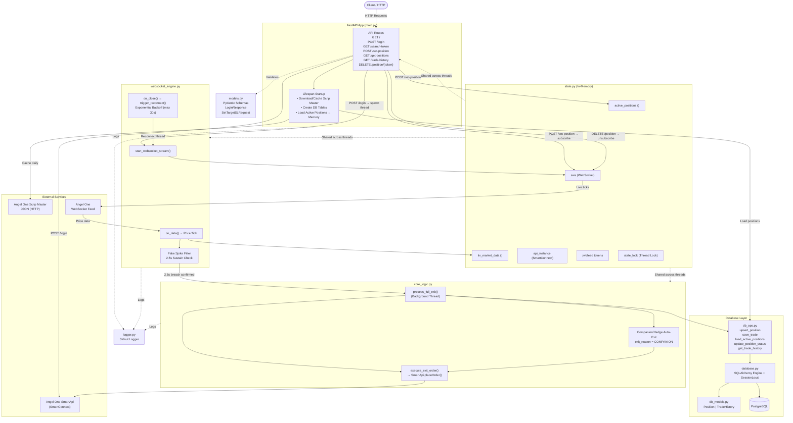

# Trading API (FastAPI + Angel One)

A trading backend built with **FastAPI** that automates interactions with the **Angel One** broker platform, featuring real-time WebSocket streaming, a Fake Spike filter, PostgreSQL persistence, and position tracking.



## 🚀 Key Features

- **Auto-Caching Scrip Master:** Caches Angel One Scrip Master JSON daily for fast symbol search.
- **WebSocket Streaming:** Live market price data streaming with auto-reconnect (exponential backoff).
- **Fake Spike Filter:** 2.5-second price sustainability check before firing exit orders — prevents premature exits on fake spikes.
- **PostgreSQL Persistence:** Active positions and trade history stored in PostgreSQL — survives server restarts.
- **Trade History:** Every exit (TARGET / SL / COMPANION) recorded with order ID, exit price, and timestamp.
- **Companion/Hedge Auto-Exit:** When one leg exits, linked token is automatically exited.
- **TOTP-based Auth:** Automated login with Angel One using TOTP.

## 🛠 Tech Stack

- **Framework:** FastAPI
- **Broker API:** SmartApi (Angel One)
- **Database:** PostgreSQL + SQLAlchemy 2.0 + psycopg (v3)
- **Data Validation:** Pydantic
- **Concurrency:** Threading (WebSocket streams)
- **Testing:** pytest

## 📋 Environment Variables

Copy `.env.example` to `.env` and fill in your values:

```bash
cp .env.example .env
```

```env
ANGEL_API_KEY=your_api_key_here
ANGEL_CLIENT_ID=your_client_id_here
ANGEL_PIN=your_pin_here
ANGEL_TOTP_SECRET=your_totp_secret_here
DATABASE_URL=postgresql+psycopg://<user>:<password>@localhost:5432/<dbname>
```

## 🚀 Installation & Setup

1. **Clone the repository:**

   ```bash
   git clone <repository-url>
   cd TradingAPI
   ```

2. **Create and activate virtual environment:**

   ```bash
   python -m venv venv
   source venv/bin/activate
   ```

3. **Install dependencies:**

   ```bash
   pip install -r requirements.txt
   ```

4. **Setup PostgreSQL:**

   ```bash
   sudo service postgresql start
   sudo -u postgres psql -c "CREATE DATABASE tradingdb;"
   sudo -u postgres psql -c "CREATE USER admin WITH ENCRYPTED PASSWORD 'yourpassword';"
   sudo -u postgres psql -c "GRANT ALL PRIVILEGES ON DATABASE tradingdb TO admin;"
   sudo -u postgres psql -d tradingdb -c "GRANT ALL ON SCHEMA public TO admin;"
   ```

5. **Run the API:**
   ```bash
   uvicorn main:app --reload
   ```
   DB tables auto-create on first startup.

## 🔌 API Endpoints

| Method | Endpoint         | Description                                  |
| :----- | :--------------- | :------------------------------------------- |
| `GET`  | `/`              | Home route                                   |
| `POST` | `/login`         | Authenticate with broker and start WS stream |
| `GET`  | `/search-token`  | Search for symbol token                      |
| `POST` | `/set-position`  | Start monitoring SL/Target for a token       |
| `GET`  | `/get-positions` | Fetch all open positions from broker         |

## 🏗 Spike Filter Logic

- Price hits Target or SL → `breach_time` recorded, `exit_reason` set (`TARGET` or `SL`)
- EXIT fires only if price sustains breach for **2.5 seconds**
- Price returns to normal range → filter resets (fake spike ignored)
- On exit, companion/linked token is auto-exited with reason `COMPANION`

## 🗄 Database Schema

**`positions`** — Active monitoring state, loaded back into memory on server restart

**`trade_history`** — Every exit recorded with `exit_reason` (TARGET / SL / COMPANION), `order_id`, `exit_price`, `exited_at`

## 🧪 Running Tests

```bash
pytest -v
```

19 tests — unit + integration, DB layer tested with SQLite in-memory.

---

_Developed with a focus on automation and reliability._
